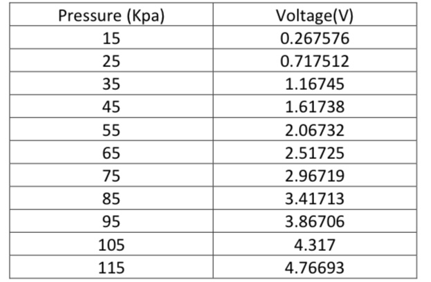
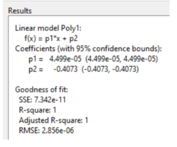
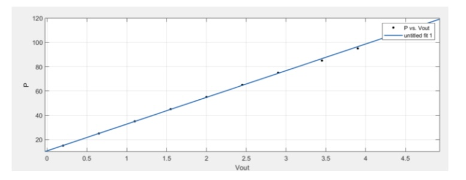
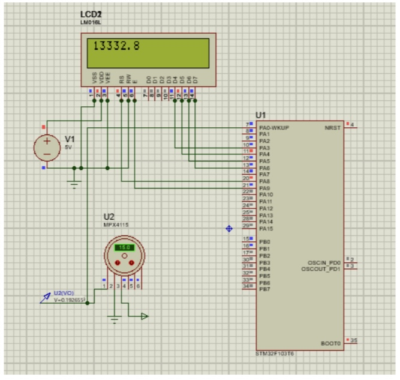

# Pressure_Sensor
Connecting a **MPX4115 pressure sensor** to a power supply and printing the measured pressure on an LCD connected to a micro-controller.

First, I connected the sensor to a **power supply**, and measured the output of the sensor in enough points in the range of its possible input values. The results are shown in the table below:

Then, by using the cftool in MATLAB, I fit the best curve possible to the data. 

The equation of the curve is: **P = 2.223e + 04 V + 9053**

By using the equation above, and using a **STM32 micro-controller**, I wrote a program to measure the pressure with the sensor, and print the result on an lcd connected to the micro-controller.

The final result:

